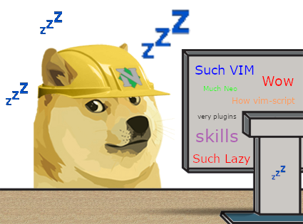
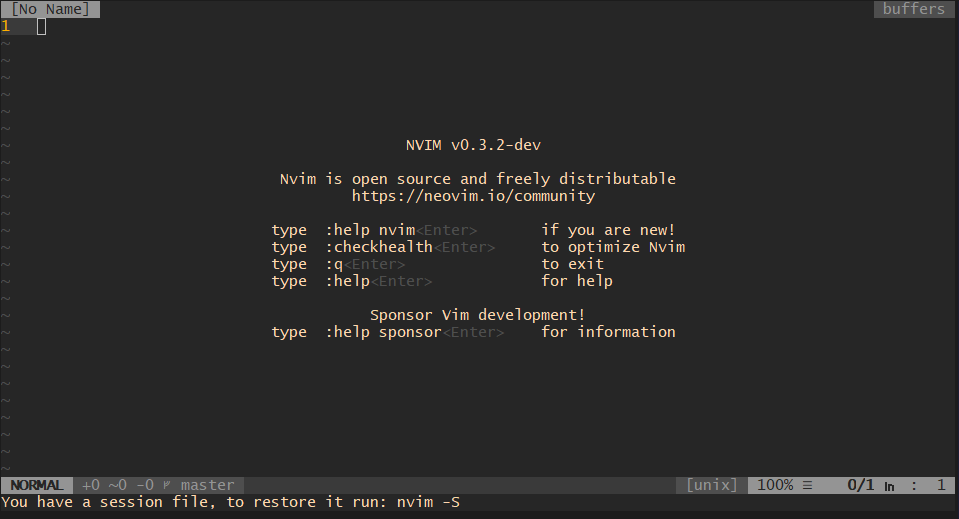
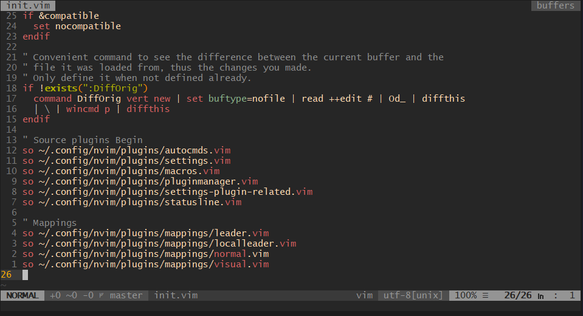

<h1 align="center">nvim</h1>

<div align="center">
  
</div>

<br>

<div align="center">
  <p>My hard config of <a href="https://neovim.io/">NeoVim</a> :tophat:</p>

  <p>Struggle one more time to never struggle again :heart:</p>
</div>

### Requirements

- Have `NeoVIM` already installed

### Relevant config files

- INIT &nbsp;&nbsp; -> [init.vim](/init.vim)
- UTILS	-> [autoload/utils.vim](/autoload/utils.vim)
- DOGE	-> [snippets/partials/doge.txt](/snippets/partials/doge.txt)
- PLUGINS -> [settings/pluginmanager.vim](/settings/pluginmanager.vim)

### Usage

```bash
git clone https://gitlab.com/cabaalexander/nvim ~/.config/nvim && nvim
```

## Design

### Start Screen



### Vim Init

